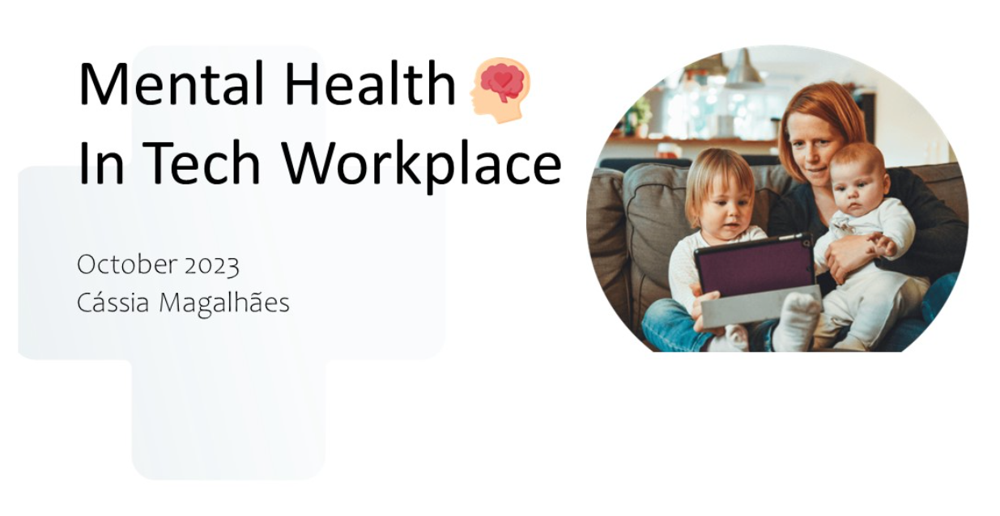

# 🧠 Mental Health in Tech Workplace – Dashboard (Power BI)

This project presents an interactive Power BI dashboard that explores **mental health patterns and attitudes in the technology sector workplace**.  
The design and insights were inspired by the **mission of Webdoctor.ie** and developed for **portfolio and educational purposes**.

---

## 📊 Dashboard Highlights

- 🌐 **Regional comparison** between USA and European Union (EU)
- 🧠 Identification of the strongest predictors of mental health conditions
- 🧩 Analysis of attitudes toward discussing mental health in the workplace
- 🧮 Built using a **star schema** data model (1 fact table + 10 dimension tables)
- 📊 Includes calculated DAX measures (all explicit) and Power Query transformations
- 🎯 Covers segmentation by **gender, age range, company size, work model, and more**

---

## 🗂️ Files Included

- `Webdoctor_MentalHealth.pbix` – Power BI Dashboard file
- `2016_survey_transformed.xlsx Converted version of the original Kaggle dataset (original format was CSV)
- `EU_Countries.xlsx - European Union country reference table (used for regional comparison with USA)
- `cover.png` – Dashboard cover image
- `README.md` – Project documentation (this file)

---

## 📷 Dashboard Preview

---

## 📚 Data Source

The dataset used is the **2016 Mental Health in Tech Survey**, publicly available on Kaggle:

🔗 https://www.kaggle.com/datasets/osmi/mental-health-in-tech-survey

> ⚠️ **Disclaimer**: This dashboard uses a cleaned and modified version of the original dataset.  
> All content is for **demonstration and educational purposes only**. The project is **not affiliated** with Webdoctor.ie or OSMI.

---

## 👩‍💻 Author

Developed by **Cássia Magalhães** – Power BI & Data Analytics Portfolio  
📅 October 2023

- 💼 [LinkedIn](https://www.linkedin.com/)
- 💻 [GitHub](https://github.com/)

---

Feel free to explore, fork, and provide feedback!
